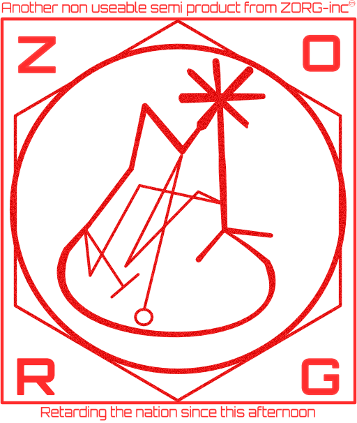

# GarbleBlarf
<p align="center">
    
</p>

## what is it?
We take synced audio (using iCloud right now) from the laptop folder i.e from a known zero config directory, this can of course be configured but right now it "just works" how I hate that term, how rarely do these things just work, anyway.  
  
Then these files are transcribed using the native frameworks or a model, right now `faster-whisper` seems to hit a sweet spot on my machine at least.  

There is also a comparisson framework as part of the app so you can just see which works best for you in terms of cpu, ram and accuracy. Youll need to pick a tect that is known by you and then see the transcription. Instructions will be provided, sort of.  
  
The comparison is not the, point the transcription is, the models get downloaded by the client, there are lot of them by default so it may take a while. I will decide which is a decent subset if you add an issue and let me know some stats (see the comparison tool for how to do this, I may just automate it)  
  
No idea how good it is for anything other than English (again comparisons).  
  
The application runs from a `cli` i.e. from the terminal. If you have no experience with this get ready for a new thrill, the thrill of text and NO BUTTONS, huzzah. If you are on a mac then press the command key and the space bar, the command button is the one with the ⌘ symbol on it. Now type `terminal`, open it.  
  
I will add more instructions but, well, it's a `cli`, there may be a GUI at some point if people request it.

Reads in the db for voice memos stored in iCloud and transcibes automagically.

## how does it work?
We take audio files from the the default store for iCloud sync and then run them through a model, either the default framework on a mac or a small (ish) embedded transcription model and then dump this into a database, these can then be dumped out to the the local filesystem to a configurable "somewhere", by default we use the `Documents` directory. It is useful to keep then in this db because it makes it easier for later tools to search this, it's just faster and, well, it's a database and thats what they are for.

## How to use
tbh your guess is as good as mine at this point... see the wiki

## Local Dev

This project uses a hybrid setup with `pyenv` for Python version management and `uv` for blazingly fast dependency management (10-100x faster than regular pip, allegedly).

### Setup

```bash
# 1. Python is managed by pyenv virtualenv, we asume you are in fact using pyenv and pyenv virtualenv to manage things
# the setup of this is not covered here, see the wiki, section `Local Dev`
# The .python-version file contains "voice_transcription"
# This auto-activates when you cd into the project directory

# 2. Install dependencies using uv (installs into the active pyenv virtualenv)
uv pip install -e ".[dev]"

# That's it. No really.
```

### Running Commands

Since the pyenv virtualenv auto-activates, you can run commands directly:

```bash
memo-transcriber --help      # Production CLI
comparator --help            # Model comparison CLI

# Examples
memo-transcriber organise --model faster-whisper-base --max-duration 10
memo-transcriber db-stats
comparator compare-all <UUID>
```

### Alternative: Modern uv workflow

If you prefer the new hotness:

```bash
uv sync --extra dev          # Installs everything in editable mode
uv run memo-transcriber --help
```

**Why the hybrid?** pyenv manages Python versions (because we need 3.13+), uv manages packages (because waiting for pip is so 2023).

## Notes on permissions
You'll need to grant the terminal full disk access for this to work.

## Who We Are (not)

<p align="center">
  
</p>


