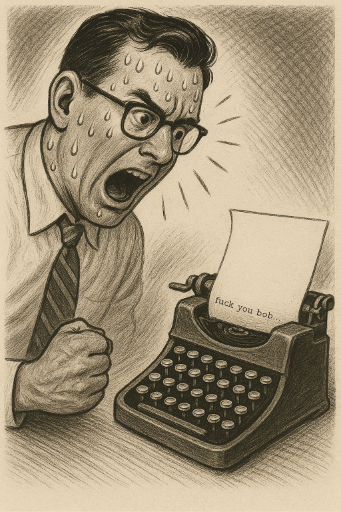

# GarbleBlarf

    

## what is it?

We take synced audio (using iCloud right now) from the laptop folder i.e from a known zero config directory, this can of course be configured but right now it "just works" how I hate that term, how rarely do these things just work, anyway.  
  
Then these files are transcribed using the native frameworks or a model, right now `faster-whisper` seems to hit a sweet spot on my machine at least.  

There is also a comparisson framework as part of the app so you can just see which works best for you in terms of cpu, ram and accuracy. Youll need to pick a tect that is known by you and then see the transcription. Instructions will be provided, sort of.  
  
The comparison is not the, point the transcription is, the models get downloaded by the client, there are lot of them by default so it may take a while. I will decided which is a decent subset if you add an issue and let me know some stats (see the comparison tool for how to do this, I may just automate it)  
  No idea how good it is anything other than english (again comparisons).  
  
The application runs from a `cli` i.e from the terminal. If you have no experience with this get ready for a new thrill, the thrill of text and NO BUTTONS, huzzah. If you are on a mac then press the command ley and the space bar, The command button is the one with the ⌘ symbol on it. Now type `teminal` open it.  
  
I will add more instructions but, well, it's a `cli`, there may be a GUI at some point if people request it.
Reads in the db for voice memos stored in iCloud and transcibes automagically.

## how does it work?
  We take audio files from the the default store for iCloud sync and then run them through a model, either the default framework on a mac or a small (ish) embedded transcription model and then dump this into a database, these can then be dumped out to the the local filesystem to a configurable "somewhere", by default we use the `Documents` directory. It is useful to keep then in this db because it makes it easier for later tools to search this, it's just faster and, well, it's a database and thats what they are for.

## Notes on permissions

You'll need to grant the terminal full disk access for this to work.

  <svg viewBox="0 0 1000 220" width="100%" preserveAspectRatio="xMidYMid meet" xmlns="http://www.w3.org/2000/svg" role="img" aria-labelledby="title">
    <title>this has been a non usable semi product from ZORG inc. — Retarding the nation since this afternoon</title>

    <!-- Title: two lines, centered -->
    <text x="50%" y="90" text-anchor="middle" font-size="48" font-family="Arial, sans-serif" fill="#111">
      this has been a non usable semi product from ZORG inc.
    </text>
    <text x="50%" y="155" text-anchor="middle" font-size="40" font-family="Arial, sans-serif" fill="#111">
      Retarding the nation since this afternoon
    </text>

    <!-- Circular TM badge (positions scale with the SVG) -->
    <g transform="translate(900,70)">
      <circle r="20" fill="none" stroke="#111" stroke-width="3"/>
      <text y="6" text-anchor="middle" font-size="18" font-family="Arial, sans-serif" fill="#111">TM</text>
    </g>
  </svg>

  

